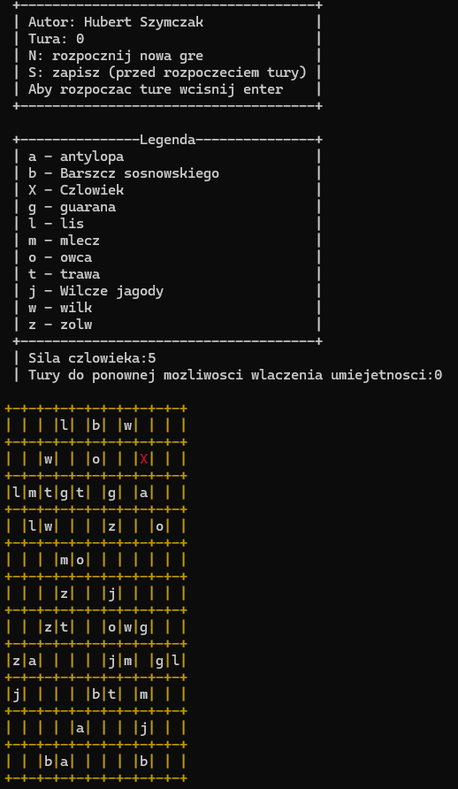
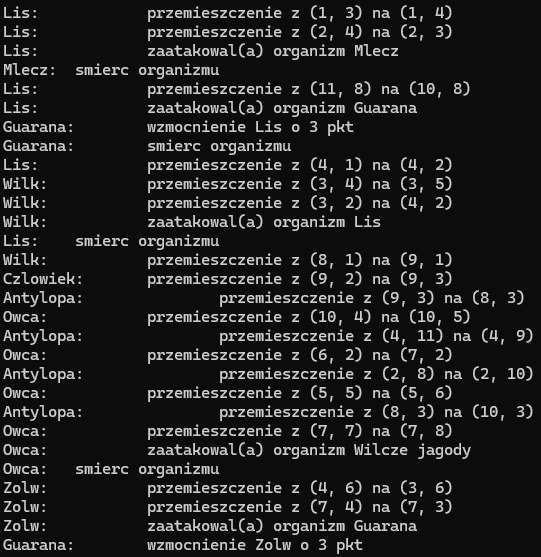

# Virtual World Simulator

    
    

## Description
Virtual World Simulator is a turn-based simulation program written in C++ that models a dynamic virtual ecosystem on a 2D grid. Each cell in the grid can be occupied by various types of organisms, including animals and plants, which exhibit unique behaviors and interact with each other in complex ways. The goal of this project is to simulate a virtual world with user-defined or default dimensions, showcasing the interactions and survival mechanisms of different life forms.

## Features
- **Customizable World Size**: Define the size of the 2D grid.
- **Organism Types**: Includes multiple animal and plant species with distinct behaviors.
- **Turn-Based Simulation**: Organisms perform actions based on their type in each turn.
- **Human Character**: Controlled by the player using keyboard arrows with a special ability.
- **Collision Handling**: Manages interactions when organisms occupy the same cell.
- **Organism Behavior**:
  - **Animals**: Move, reproduce, and engage in conflicts.
  - **Plants**: Spread to adjacent cells.
- **Console Visualization**: Uses ASCII symbols for a visual representation of the world.
- **Event Reporting**: Displays updates on interactions, fights, and other events.
- **Save and Load**: Allows the game state to be saved to a file and loaded from a file, enabling you to continue your simulation from where you left off.

## Classes and Methods

### Class `Swiat` (World)
Manages the game world and its organisms.
- **Methods**:
  - `wykonajTure()`: Executes a turn.
  - `rysujSwiat()`: Draws the current state of the world.
- **Fields**:
  - `organizmy`: List of organisms in the world.

### Class `Organizm` (Organism)
Abstract base class for all organisms.
- **Fields**:
  - `siła` (strength)
  - `inicjatywa` (initiative)
  - `położenie` (position)
  - `świat` (reference to world)
- **Methods**:
  - `akcja()`: Defines the organism's behavior during a turn.
  - `kolizja()`: Defines the organism's behavior during a collision.
  - `rysowanie()`: Draws the organism.

### Subclasses
- **Animal (`Zwierze`)**: Implements common behaviors for animals, such as movement and reproduction.
- **Human (`Człowiek`)**: Extends `Zwierze`, controlled by the player, with a special ability.
- **Plant (`Roślina`)**: Implements common behaviors for plants, such as spreading.

